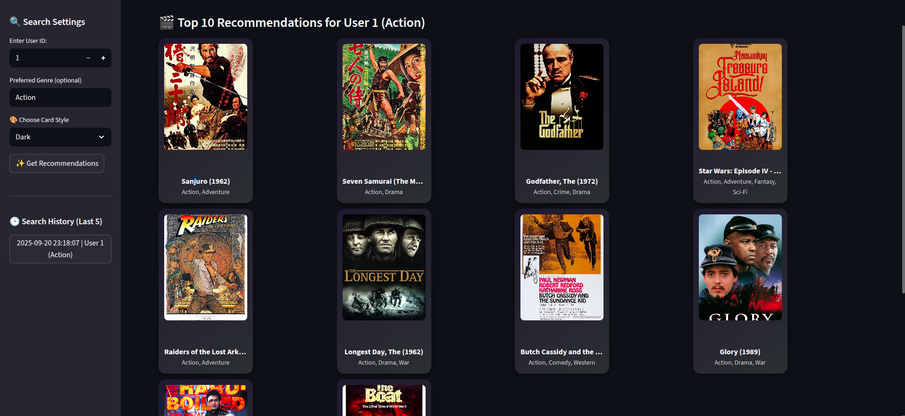

# Context Aware Recommendation System

A personalized Movie Recommendation System built using Machine Learning, designed to suggest movies based on user preferences. The system includes a complete data processing and modeling pipeline, and a sleek Streamlit frontend for interactive recommendations.

## Streamlit Page 




## Features

- Personalized movie recommendations for users.

- Uses Matrix Factorization for collaborative filtering.

- Supports search history tracking.

- Beautiful UI with movie posters displayed.

- Fetches posters via Google Images API.

- Lightweight, easy-to-deploy Streamlit interface.

## Technology Stack

-   Python 3.10+

- Libraries: pandas, numpy, torch, scikit-learn, pickle, streamlit

- Machine Learning: Matrix Factorization (MF)

- Frontend: Streamlit

- Data: MovieLens dataset

## Methodology & Workflow

### 1.Data Collection & Loading
- Load raw dataset of users, movies, and ratings.
### 2.Data Preprocessing
- Encode user IDs and movie IDs.

- Handle missing values.

- Feature engineering for enhanced recommendation quality.
### 3.Model Training
- Train a Matrix Factorization (MF) model.

- Save model and encoders for inference.
### 4.Model Inference
- Input: user ID or movie preference.

- Output: Top N recommended movies with posters.
### 5.Frontend Interaction
- Users can search movies.

- Recommended movies displayed with posters.

- Search history stored locally in session.

## Quick Start / Execution Process

1. **Clone Repository**
```bash
git clone https://github.com/yourusername/movie-recommendation.git
cd movie-recommendation
```

2. **Setup Virtual Environment**
```bash
python -m venv myenv
source myenv/bin/activate   # Linux/Mac
myenv\Scripts\activate      # Windows
```

3. **Install Dependencies**
```bash
pip install -r requirements.txt
```

4. **Run pipeline**
```bash
python -m src.model
```

5. **Launch Streamlit**
```bash
streamlit run image_app.py
```

## Structure of Project 

```bash
movie-recommendation/
├── data/
│   ├── raw/
│   └── processed/
├── saved_model/
├── src/
│   ├── models/
│   │   ├── mf.py
│   │   ├── ncf.py
│   │   └── sequential.py
│   ├── model.py
│   ├── train.py
│   └── utils.py
├── image_app.py
├── app.py
├── requirements.txt
├── README.md
└── .gitignore
```

## Flow Chart 

```bash 

[Load Raw Data] --> [Preprocess & Encode] --> [Train MF Model] --> [Save Model & Encoders]
        |
        v
[Streamlit App]
        |
        v
[Input: User/Movie] --> [Predict Recommendations] --> [Display Movie Poster & Title]
```

## References

- [MovieLens Dataset](https://grouplens.org/datasets/movielens/)
- [Matrix Factorization in PyTorch](https://pytorch.org/tutorials/)
- [Streamlit Documentation](https://docs.streamlit.io/)
